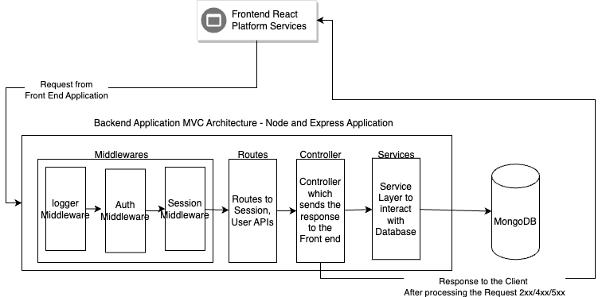

# NEU-Event-Hub
A One stop solution to display events in and around Northeastern University so that students can socialize and network

## Frontend Architecture

* React v18 and react-bootstrap were used to build the front end of the application 

## Backend Architecture

* Node and Express.js were used to build the backend application

### Steps to run **only** backend code 

* Go inside server directory using command `cd server`
* Run `npm i ` or `npm install` to install the dependencies present in package.json
* After successful installation of dependencies, run `npm run start` to start the application
* Use Postman to hit the APIs with out any front end application to test and develop the APIs  

